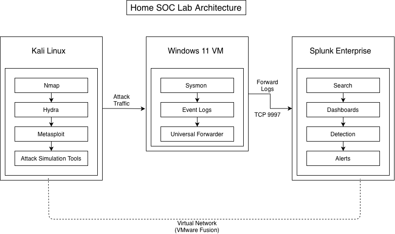
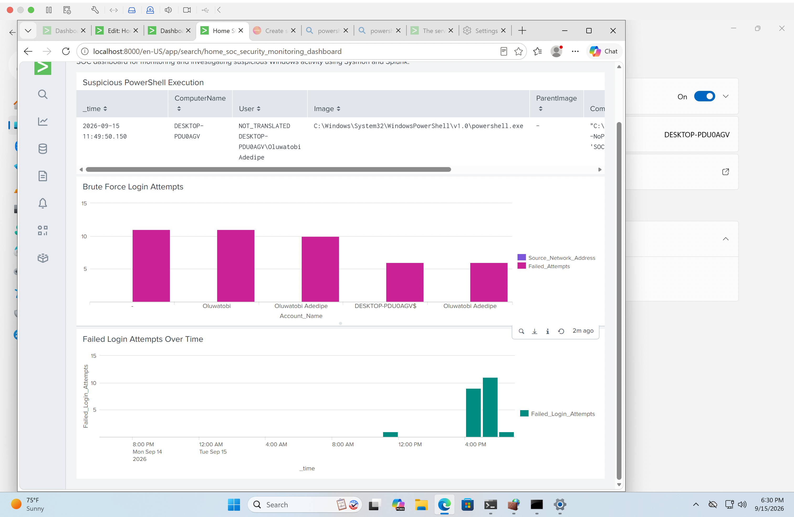

# Home SOC Lab
A hands-on Security Operations Center (SOC) lab built to practice security monitoring, threat detection, log analysis, alert creation, incident investigation, and MITRE ATT&CK mapping using Splunk, Sysmon, Windows 11, and Kali Linux.
## Project Overview
This project simulates a small SOC environment where Windows security activity is collected, forwarded to Splunk, analyzed, and investigated.
The lab demonstrates an end-to-end SOC workflow:
**Generate Activity → Collect Logs → Forward Events → Analyze in Splunk → Detect Suspicious Activity → Investigate → Alert → Document Incident**
The project currently focuses on two detection scenarios:
- Suspicious PowerShell execution
- Windows brute-force / repeated failed login attempts
---
## Lab Architecture

The environment includes:

- macOS host system
- VMware Fusion
- Windows 11 ARM virtual machine
- Kali Linux ARM virtual machine
- Sysmon
- Splunk Universal Forwarder
- Splunk Enterprise

Windows security and Sysmon events are collected from the Windows VM and forwarded to Splunk for analysis.

### Architecture Diagram


---
## Detection 1 — Suspicious PowerShell Execution

A Splunk detection was created to identify suspicious PowerShell executions recorded by Sysmon.

The detection looks for PowerShell processes using suspicious command-line options such as:

- `ExecutionPolicy Bypass`
- `EncodedCommand`
- `-enc`
- `NoProfile`

**Example SPL:**

```spl
index=* sourcetype="WinEventLog:Microsoft-Windows-Sysmon/Operational"
EventCode=1
Image="*powershell.exe"
(CommandLine="*-ExecutionPolicy Bypass*" OR
 CommandLine="*-EncodedCommand*" OR
 CommandLine="*-enc *" OR
 CommandLine="*-NoProfile*")
| table _time ComputerName User Image ParentImage CommandLine
```

**Investigation**

The detected PowerShell activity was reviewed in Splunk using Sysmon process creation telemetry.

Relevant information included:

- Timestamp
- Host
- User
- Process image
- Parent process
- Command line

The investigation is documented in:

`incident-reports/01-suspicious-powershell-investigation.md`

**MITRE ATT&CK Mapping**

**Tactic:** Execution  
**Technique:** PowerShell  
**Technique ID:** T1059.001 — PowerShell

⸻

## Detection 2 — Brute-Force Login Attempts

Windows Security Event ID `4625` was used to identify failed authentication attempts.

**Example SPL:**

```spl
index=* sourcetype="WinEventLog:Security" EventCode=4625
| bin _time span=5m
| stats count as Failed_Attempts by _time Account_Name Source_Network_Address
| where Failed_Attempts >= 5
| sort - Failed_Attempts
```

The detection identifies 5 or more failed Windows authentication attempts associated with the same account and source network address within a 5-minute time bucket.

**Investigation**

The brute-force investigation included analysis of:

- Failed login attempts
- Target accounts
- Source network addresses
- Event frequency
- Authentication activity over time

The investigation is documented in:

`incident-reports/02-brute-force-investigation.md`

**Alerting**

A scheduled Splunk alert named:

**Brute Force Login Detection**

was configured to automatically evaluate failed Windows authentication events.

**MITRE ATT&CK Mapping**

**Tactic:** Credential Access  
**Technique:** Brute Force  
**Technique ID:** T1110 — Brute Force

⸻
## SOC Monitoring Dashboard

A Splunk dashboard was created to provide a centralized view of security activity.



### Dashboard Panels

**Suspicious PowerShell Execution**

Displays suspicious PowerShell processes detected through Sysmon telemetry.

**Brute Force Login Attempts**

Displays failed authentication attempts grouped by account and source network address.

**Failed Login Attempts Over Time**

Displays failed authentication activity over time, making bursts or spikes in login failures easier to identify.

⸻

## Incident Response Workflow

The lab follows a basic SOC investigation workflow:

1. **Security Activity** — Security activity occurs on the endpoint.
2. **Event Logging** — Windows and Sysmon record the activity.
3. **Log Forwarding** — Splunk Universal Forwarder sends the events to Splunk Enterprise.
4. **Log Analysis** — Splunk searches analyze the collected telemetry.
5. **Threat Detection** — Detection logic identifies potentially suspicious behavior.
6. **Alerting** — Splunk alerts notify the analyst when detection conditions are met.
7. **Investigation** — The analyst reviews related events and determines what occurred.
8. **MITRE ATT&CK Mapping** — Detected activity is mapped to relevant MITRE ATT&CK techniques.
9. **Incident Documentation** — Investigation findings are documented in an incident report.

⸻

## Repository Structure

```text
Home-SOC-Lab/
├── configs/
│   ├── README.md
│   ├── inputs.conf
│   └── outputs.conf
│
├── detection-rules/
│   ├── README.md
│   ├── brute-force-detection.spl
│   ├── brute-force-mitre-mapping.md
│   ├── powershell-detection.spl
│   └── powershell-mitre-mapping.md
│
├── diagrams/
│
├── docs/
│   ├── README.md
│   ├── 02-splunk-installation.md
│   ├── 03-sysmon-installation.md
│   ├── 04-log-forwarding.md
│   └── 09-Kali-Installation.md
│
├── incident-reports/
│   ├── README.md
│   ├── 01-suspicious-powershell-investigation.md
│   └── 02-brute-force-investigation.md
│
├── screenshots/
│   ├── brute-force-detection-splunk.png
│   ├── brute-force-alert-configured.png
│   └── final-soc-dashboard.png
│
├── scripts/
├── LICENSE
└── README.md
```

⸻

## Skills Demonstrated

This project demonstrates practical experience with:

- **SOC Monitoring**
- **SIEM Fundamentals**
- **Splunk Enterprise**
- **SPL Queries**
- **Windows Event Logs**
- **Sysmon**
- **Splunk Universal Forwarder**
- **Log Collection and Forwarding**
- **Security Event Analysis**
- **PowerShell Detection**
- **Authentication Monitoring**
- **Brute-Force Detection**
- **Alert Configuration**
- **Incident Investigation**
- **MITRE ATT&CK Mapping**
- **Security Documentation**

⸻

## Key Takeaways

Building this lab provided hands-on experience with the workflow a SOC analyst uses to move from raw endpoint telemetry to actionable security detections.

Instead of only generating logs, the project demonstrates the complete process of:

- Collecting security telemetry
- Forwarding Windows and Sysmon events to Splunk
- Writing SPL detection logic
- Identifying suspicious activity
- Investigating security events
- Creating Splunk alerts
- Mapping detections to MITRE ATT&CK
- Building a SOC monitoring dashboard
- Documenting investigation findings

This project strengthened my understanding of how endpoint telemetry, SIEM monitoring, detection engineering, and incident investigation work together in a SOC environment.

---

## Disclaimer

All attack simulations and security testing performed in this project were conducted in an **isolated lab environment for educational and cybersecurity training purposes only**.
