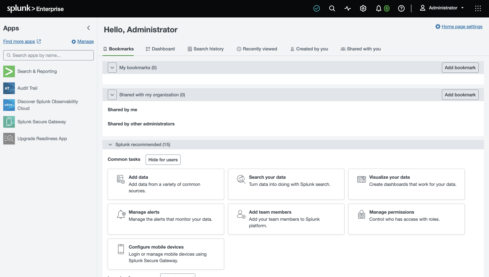

# Splunk Enterprise Installation

## Objective

Install Splunk Enterprise as the SIEM platform for the Home SOC Lab.

---

## Environment

- Host OS: macOS
- Virtualization: VMware Fusion
- Windows VM: Windows 11 ARM
- Splunk Version: 10.4.1

---

## Installation Status

- ✅ Downloaded Splunk Enterprise
- ✅ Installed successfully
- ✅ Administrator account created
- ✅ Web interface accessible

---

## Evidence

---

## Skills Demonstrated

- SIEM Deployment
- Splunk Enterprise Installation
- Security Platform Configuration
- macOS Administration
- Virtual Lab Setup
