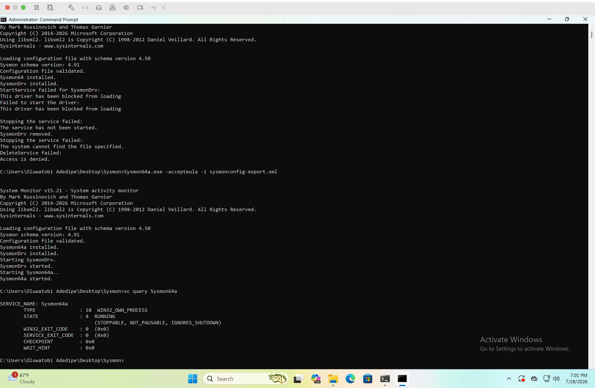

# Sysmon Installation

## Status

- ✅ Downloaded Sysmon
- ✅ Copied Sysmon to the Windows VM
- ✅ Installed Sysmon64a
- ✅ Applied Sysmon configuration
- ✅ Verified Sysmon service is running

## Verification

```text
SERVICE_NAME: Sysmon64a

STATE : 4 RUNNING
```

## Evidence



## Skills Demonstrated

- Windows Endpoint Monitoring
- Sysmon Deployment
- Security Event Logging
- Windows Command Line
- Endpoint Telemetry Collection
