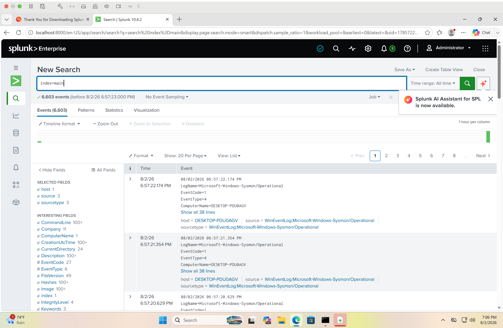

# 04 - Log Forwarding

## Objective

The goal of this step was to configure the Splunk Universal Forwarder to send Windows Sysmon logs to Splunk Enterprise.

---

## Components

- Windows 11 ARM Virtual Machine
- Splunk Enterprise
- Splunk Universal Forwarder
- Sysmon

---

## Configuration

### Splunk Enterprise

Configured Splunk Enterprise to receive forwarded data on TCP port **9997**.

### Universal Forwarder

Configured the Universal Forwarder to:

- Monitor the Microsoft Windows Sysmon Operational log.
- Forward collected events to Splunk Enterprise.
- Use the main index for log storage.

---

## Verification

After restarting the Universal Forwarder, Splunk successfully received Sysmon events.

Verification search:

```spl
index=main
```

Result:

- More than 6,000 Sysmon events were successfully indexed.
- Source:
  - WinEventLog:Microsoft-Windows-Sysmon/Operational
- Sourcetype:
  - WinEventLog:Microsoft-Windows-Sysmon/Operational

---

## Screenshot



---

## Outcome

The Home SOC Lab successfully ingests Windows Sysmon logs into Splunk Enterprise. This provides visibility into Windows process creation, network connections, file creation, and other endpoint activity for future threat detection and investigation.
