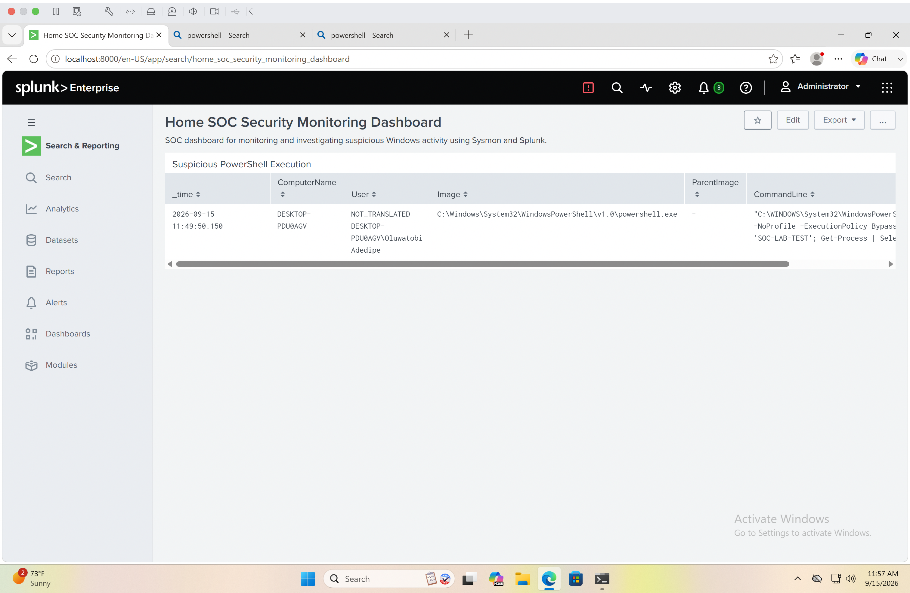
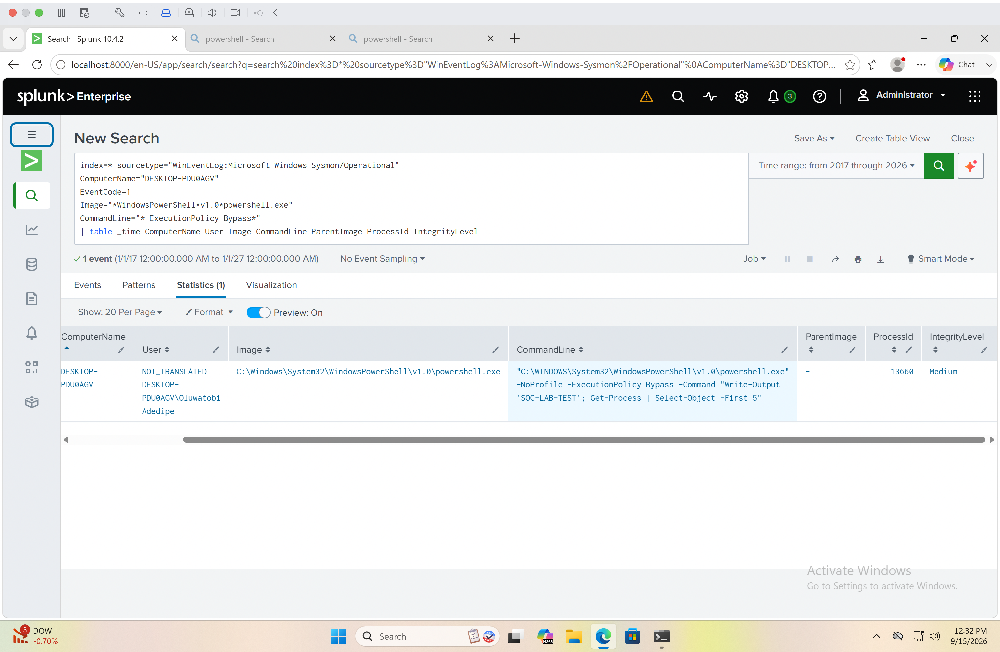

# Incident Report 01 — Suspicious PowerShell Execution

## Incident Summary

A suspicious PowerShell execution was detected on the Windows endpoint by Sysmon and investigated using Splunk Enterprise.

The detection triggered because PowerShell was executed with the `-ExecutionPolicy Bypass` option. This option can be used legitimately, but attackers may also use it to bypass PowerShell execution-policy restrictions.

## Detection Details

- **Date:** September 15, 2026
- **Time:** 11:49:50 AM
- **Host:** DESKTOP-PDU0AGV
- **Event Source:** Microsoft-Windows-Sysmon/Operational
- **Sysmon Event ID:** 1 — Process Creation
- **Process:** powershell.exe
- **Process ID:** 13660
- **Integrity Level:** Medium
- **Parent Image:** Not available in the collected event

## Suspicious Command

The detected PowerShell command was:

    powershell.exe -NoProfile -ExecutionPolicy Bypass -Command "Write-Output 'SOC-LAB-TEST'; Get-Process | Select-Object -First 5"

## Investigation

The event was investigated in Splunk using Sysmon process-creation telemetry.

The investigation confirmed that Windows PowerShell executed with the `-ExecutionPolicy Bypass` argument.

The command also contained `SOC-LAB-TEST`, which identified the activity as the controlled PowerShell test intentionally executed as part of the Home SOC Lab.

Additional process activity surrounding the event was reviewed to provide context for the execution.

## Analysis

`-ExecutionPolicy Bypass` is security-relevant because it allows PowerShell to execute without applying normal execution-policy restrictions.

Because similar PowerShell behavior can appear during malicious activity, the event warranted investigation.

However, no evidence of malicious activity was identified during this investigation. The command was intentionally generated as part of the lab to verify that Sysmon telemetry, Splunk ingestion, detection logic, and investigation workflows were functioning correctly.

## Classification

**Alert Type:** Suspicious PowerShell Execution

**Severity:** Low

**Disposition:** Benign / Authorized Security Test

**Status:** Closed

## Evidence

Detection dashboard:

Investigation evidence:

## Conclusion

The PowerShell detection successfully identified potentially suspicious command-line behavior.

The investigation determined that the activity was an authorized lab simulation rather than malicious activity.

This exercise demonstrated the complete SOC workflow of:

**Telemetry Collection → Detection → Investigation → Analysis → Classification → Documentation**
