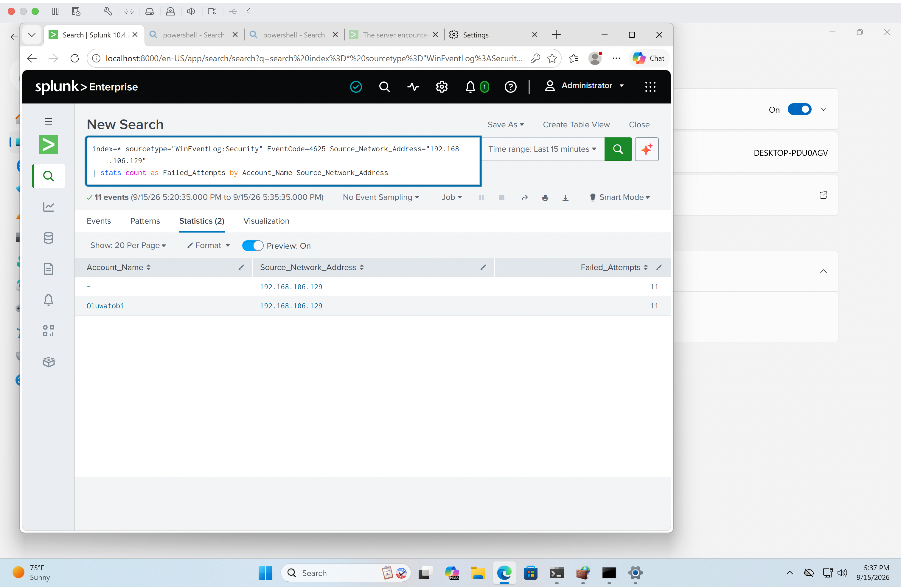

# Incident Report 02 — Brute-Force Login Detection

## Incident Summary

A simulated brute-force authentication test was performed against the Windows 11 VM from the Kali Linux VM in the isolated Home SOC Lab environment.

Repeated failed authentication attempts generated Windows Security Event ID `4625` events, which were collected and analyzed in Splunk Enterprise.

The activity was intentionally generated for detection testing and SOC investigation practice.

## Incident Details

- **Environment:** Home SOC Lab
- **Source System:** Kali Linux VM
- **Target System:** Windows 11 VM
- **SIEM:** Splunk Enterprise
- **Data Source:** Windows Security Event Log
- **Event ID:** 4625 — Failed Logon
- **Source IP:** `192.168.106.129`
- **Target Account:** `Oluwatobi`
- **Classification:** Simulated Brute-Force Activity
- **Disposition:** Authorized Lab Simulation
- **Status:** Closed

## Detection Logic

The detection identifies repeated Windows authentication failures associated with the same account and source network address.

Events are grouped into 5-minute time buckets, and the detection returns results when 5 or more failed authentication attempts occur within a bucket.

```spl
index=* sourcetype="WinEventLog:Security" EventCode=4625
| bin _time span=5m
| stats count as Failed_Attempts by _time Account_Name Source_Network_Address
| where Failed_Attempts >= 5
| sort - Failed_Attempts
```

## Findings

Splunk identified repeated failed authentication attempts originating from:

- **Source IP:** `192.168.106.129`
- **Target Account:** `Oluwatobi`
- **Windows Event ID:** `4625`

The repeated authentication failures met the detection threshold and were identified by the brute-force detection rule.

## Investigation and Analysis

The investigation focused on the frequency of failed authentication attempts, the target account, and the originating source network address.

The events showed repeated failed authentication activity associated with the same source and account within a short period.

Because the activity was intentionally generated as part of the Home SOC Lab, it was determined to be an authorized security test rather than an actual compromise.

## MITRE ATT&CK Mapping

- **Tactic:** Credential Access
- **Technique:** Brute Force
- **Technique ID:** T1110

## Evidence



## Response / Remediation

Because this activity was an authorized lab simulation, no remediation was required.

In a real environment, an analyst would investigate the source of the failed authentication attempts, review related authentication activity, determine whether any login attempts eventually succeeded, and evaluate appropriate account or source-based protections.

## Analyst Conclusion

The simulated authentication activity was successfully collected through Windows Security logging and detected in Splunk using a reusable SPL detection rule.

The investigation demonstrated the process of identifying repeated authentication failures, analyzing the associated account and source network address, mapping the activity to MITRE ATT&CK, and documenting the findings.

**Final Disposition:** Authorized Lab Simulation — No Compromise Identified
